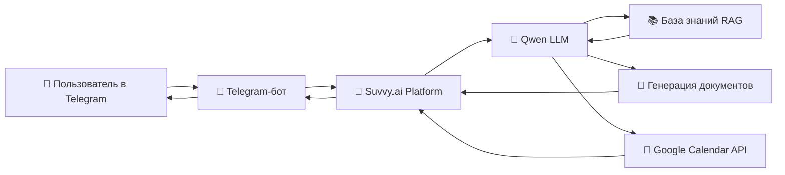

# 🤖 ИИ-ассистент: помощник бухгалтера и секретарь

ссылка на проект @Mbuhgaltersekretar_bot


> **Статус проекта**: 🟡 В разработке  
> **Версия документа**: 1.1  
> **Дата обновления**: Март 2026  
> **Автор**: Елена  
> **Канал доставки**: 📱 Telegram-бот

---

## 📋 Оглавление

1. [📌 Описание проекта](#-описание-проекта)
2. [🎯 Цели и задачи](#-цели-и-задачи)
3. [⚙️ Функциональные требования](#-функциональные-требования)
4. [🏗️ Техническая архитектура](#-техническая-архитектура)
5. [🔧 Используемые сервисы](#-используемые-сервисы)
6. [📚 Структура базы знаний](#-структура-базы-знаний)
7. [💬 Сценарии использования](#-сценарии-использования)
8. [🚀 План реализации](#-план-реализации)
9. [📊 Ожидаемые результаты](#-ожидаемые-результаты)
10. [🔮 Дорожная карта развития](#-дорожная-карта-развития)
11. [📎 Приложения](#-приложения)

---

## 📌 Описание проекта

**«ИИ-ассистент: помощник бухгалтера и секретарь»** — это интеллектуальный Telegram-бот для автоматизации рутинных задач малого бизнеса (ИП, ООО на УСН/ОСНО).

### 🔑 Ключевые особенности
| Характеристика | Значение |
|---------------|----------|
| **Платформа** | Telegram-бот (удобно, всегда под рукой) |
| **Ядро ИИ** | Qwen (Alibaba Cloud) |
| **Конструктор** | Suvvy.ai (no-code сборка ассистента) |
| **Язык** | Русский (с учётом российской нормативной базы) |
| **Целевая аудитория** | Бухгалтеры-фрилансеры, владельцы малого бизнеса, секретари |



> 💡 **Ценность**: Ассистент работает 24/7, отвечает на вопросы по налогам, готовит документы и напоминает о дедлайнах — всё в привычном интерфейсе Telegram.

---

## 🎯 Цели и задачи

### Стратегические цели
| Цель | Метрика успеха |
|------|---------------|
| Сократить время на рутинные задачи | −3–5 часов/неделю |
| Минимизировать ошибки в отчётности | ≥95% точности ответов |
| Обеспечить мгновенный доступ к нормативке | Поиск ответа <10 секунд |
| Автоматизировать планирование | 100% синхронизация с Google Calendar |

### Тактические задачи (спринт 1–2 недели)
```markdown
- [ ] Разработать системный промпт для Qwen (роль, ограничения, стиль)
- [ ] Собрать и структурировать базу знаний: НК РФ, сроки отчётности, шаблоны
- [ ] Настроить Suvvy: подключение Qwen, вебхуки, логика диалога
- [ ] Реализовать Telegram-интерфейс: команды, кнопки, форматирование
- [ ] Подключить Google Calendar API (OAuth 2.0)
- [ ] Протестировать 20+ типовых сценариев
- [ ] Подготовить инструкцию для пользователя
```

---

## ⚙️ Функциональные требования

### 1. 🗣️ Осмысленное ведение диалога
- Понимание контекста в рамках сессии (память диалога)
- Распознавание интентов: `вопрос_по_налогам`, `создать_документ`, `добавить_в_календарь`
- Поддержка уточняющих вопросов и многошаговых сценариев
- Корректная обработка ошибок: «Я не нашёл информацию по вашему запросу. Уточните, пожалуйста...»

### 2. 📚 Ответы по базе знаний (RAG-поиск)
- Поиск по нормативным документам: НК РФ, ФЗ, письма Минфина, ФНС
- Ответы по специфике: УСН «Доходы», УСН «Доходы−Расходы», патент, ОСНО
- Указание источников и дат актуальности информации
- Автоматическое предупреждение об изменениях в законодательстве (при наличии данных)

### 3. 📄 Подготовка документов
| Тип документа | Поля для подстановки | Формат экспорта |
|--------------|---------------------|-----------------|
| Счёт на оплату | ИНН, КПП, сумма, назначение, реквизиты | PDF, текст в сообщении |
| Акт выполненных работ | Период, услуги, сумма, подписанты | PDF, DOCX |
| Доверенность | ФИО, паспорт, полномочия, срок | Текст + шаблон |
| Письмо контрагенту | Тема, текст, вложения | Текст в сообщении |

> ✅ Все документы генерируются на основе шаблонов с подстановкой данных из профиля пользователя.

### 4. 📅 Интеграция с Google Календарём
- Добавление событий по команде:  
  `"Напомни сдать 4-ФСС до 20 апреля"` → событие с напоминанием за 3 дня
- Синхронизация с налоговым календарём РФ (опционально)
- Команды управления:
  ```
  /calendar добавить [событие] [дата] [время]
  /calendar список [сегодня/неделя/месяц]
  /calendar удалить [ID_события]
  ```
- Уведомления в Telegram за 1 день и за 1 час до события

### 5. 📱 Интерфейс в Telegram
- Поддержка команд: `/start`, `/help`, `/menu`, `/settings`
- Inline-кнопки для быстрых действий: `[📄 Создать счёт]` `[📅 Добавить в календарь]`
- Форматирование ответов: жирный, код, списки (MarkdownV2)
- Защита персональных данных: не сохранять реквизиты без явного согласия

---

## 🏗️ Техническая архитектура

```
┌─────────────────────────────────┐
│  👤 Пользователь (Telegram)     │
└────────────┬────────────────────┘
             │ HTTPS / Bot API
┌────────────▼────────────────────┐
│  🤖 Telegram Bot (Webhook)      │
│  • Обработка сообщений          │
│  • Форматирование ответов       │
│  • Inline-клавиатуры            │
└────────────┬────────────────────┘
             │ Вебхук
┌────────────▼────────────────────┐
│  🔧 Платформа Suvvy.ai          │
│  • Маршрутизация интентов       │
│  • Управление сессиями          │
│  • Интеграции (Qwen, Google)    │
└──────┬─────────────┬────────────┘
       │             │
┌──────▼─────┐ ┌────▼────────────┐
│ 🧠 Qwen    │ │ 📅 Google       │
│ • Системный│ │ Calendar API    │
│   промпт   │ │ • OAuth 2.0     │
│ • RAG-поиск│ │ • REST-методы   │
│ • Генерация│ │ • Events CRUD   │
│   текста   │ └─────────────────┘
└──────┬─────┘
       │
┌──────▼─────────────────────────┐
│ 📚 База знаний (векторное хранилище) │
│ • НК РФ, ФЗ, письма Минфина    │
│ • Шаблоны документов           │
│ • Чек-листы и FAQ              │
│ • Локальные реквизиты пользователя │
└────────────────────────────────┘
```

---

## 🔧 Используемые сервисы

### 🧠 Qwen (Alibaba Cloud)
| Параметр | Настройка |
|----------|-----------|
| **Модель** | Qwen2.5-72B-Instruct (или доступная через API) |
| **Температура** | 0.2–0.3 (для точности в бухгалтерии) |
| **Max tokens** | 2048 (баланс скорости и детализации) |
| **Язык** | Русский (приоритет), с поддержкой терминов РФ |
| **Роль в проекте** | Обработка запросов, RAG-поиск, генерация текста |

> 💡 **Промпт-инжиниринг**:  
> В системный промпт обязательно включить:
> ```text
> Ты — помощник бухгалтера для ИП и ООО в РФ. 
> Отвечай только на основании действующего законодательства РФ. 
> Если не уверен в ответе — скажи: «Рекомендую уточнить в ФНС/Минфине». 
> Не выдумывай статьи, даты, суммы. 
> Стиль: профессиональный, но понятный, без канцелярита.
> ```

### 🤖 Suvvy.ai
| Параметр | Значение |
|----------|----------|
| **Роль** | No-code платформа для сборки и деплоя ассистента |
| **Ключевые функции** | Визуальный конструктор диалогов, управление вебхуками, аналитика |
| **Интеграции** | Qwen (API), Google Calendar (OAuth), Telegram Bot API |
| **Документация** | [https://suvvy.ai/docs](https://suvvy.ai/) |

### 📱 Telegram Bot API
| Параметр | Значение |
|----------|----------|
| **Создание бота** | Через @BotFather, получение токена |
| **Методы** | `sendMessage`, `sendDocument`, `setWebhook`, `editMessageReplyMarkup` |
| **Форматирование** | MarkdownV2 (поддержка жирного, кода, ссылок) |
| **Безопасность** | Валидация входящих вебхуков, ограничение по IP (опционально) |

### 📅 Google Calendar API
| Параметр | Значение |
|----------|----------|
| **Авторизация** | OAuth 2.0 (User Token) или Service Account |
| **Необходимые права** | `calendar.events`, `calendar.readonly` |
| **Основные методы** | `events.insert`, `events.list`, `events.delete` |
| **Часовой пояс** | `Europe/Moscow` (по умолчанию) |

---

## 📚 Структура базы знаний

```
knowledge-base/
├── legislation/
│   ├── nalogovyj-kodeks/
│   │   ├── glava-26.2-usn.md          # УСН: объекты, ставки, ограничения
│   │   ├── sroki-otchetnosti-2026.md  # Календарь дедлайнов
│   │   ├── strahovye-vznosy.md        # Взносы: ставки, льготы, расчёт
│   │   └── nds-dlya-usn.md            # Когда УСН платит НДС
│   ├── federal-laws/
│   │   ├── 402-fz-buhuchet.md
│   │   └── 212-fz-strahovye.md
│   └── minfin-letters/
│       ├── po-usn-2026.md
│       └── po-onlain-kassam.md
├── templates/
│   ├── schet-na-oplatu.md
│   ├── akt-vypolnennyh-rabot.md
│   ├── doverennost-obrazets.md
│   └── pisymo-kontragentu.md
├── checklists/
│   ├── registraciya-ip-ooo.md
│   ├── zakrytie-kvartala.md
│   ├── podgotovka-k-proverke.md
│   └── perehod-s-usn-na-osno.md
├── faq/
│   ├── chastye-voprosy-usn.md
│   ├── kkr-onlain-kassy.md
│   └── vyplaty-sotrudnikam.md
└── user-profile/
    └── rekvizity-shablon.json         # ИНН, ОГРН, банк, адрес (заполняется пользователем)
```

### 📄 Пример записи базы знаний (RAG-формат)
```markdown
## Сроки сдачи декларации по УСН за 2025 год

**Категория**: Отчётность → УСН → Декларация  
**Кто сдаёт**: 
- ИП на УСН — до 30 апреля 2026
- ООО на УСН — до 31 марта 2026

**Куда сдавать**: ФНС по месту учёта (ЭДО / лично / почта)  
**Форма**: КНД 1152017 (утв. Приказ ФНС № ЕД-7-3/903@)  
**Штраф за просрочку**: 
- 5% от неуплаченной суммы за каждый месяц (но не более 30%, не менее 1000 ₽)

**Полезные ссылки**:
- [ФНС: Декларация по УСН](https://www.nalog.ru/)
- [КонсультантПлюс: Комментарий](ссылка)

*Обновлено: 01.03.2026 | Источник: НК РФ ст. 346.23, Приказ ФНС № ЕД-7-3/903@*
```

---

## 💬 Сценарии использования

### 🎯 Сценарий 1: Вопрос по срокам отчётности
```
👤 Пользователь: Когда сдавать 6-НДФЛ за 1 квартал 2026?

🤖 Ассистент: 
Расчёт 6-НДФЛ за 1 квартал 2026 года необходимо сдать:
📅 **До 30 апреля 2026 года** (включительно)

📌 Кто сдаёт: Все налоговые агенты (ИП и ООО с сотрудниками)  
📤 Куда: ФНС по месту учёта  
⚠️ Штраф за просрочку: 1000 ₽ за каждый месяц + блокировка счёта при задержке >10 дней

Хотите, я добавлю напоминание в ваш календарь?
[✅ Да, за 3 дня] [✅ Да, за 1 день] [❌ Нет, спасибо]
```

### 🎯 Сценарий 2: Генерация счёта на оплату
```
👤 Пользователь: Подготовь счёт для ООО "Вектор" на 25 000 руб. за дизайн-проект

🤖 Ассистент: 
Готовлю счёт... Пожалуйста, подтвердите реквизиты:

🏢 Получатель: [ИП Елена / ООО "МойБизнес"]  
💳 Банк: [Т-Банк / Сбер / ...]  
📄 Назначение: Оплата по договору №__ от __.__.2026 за дизайн-проект

[✏️ Изменить реквизиты] [✅ Подтвердить]

→ После подтверждения:
✅ Счёт сформирован: `schet_Vector_20260315.pdf`
[📥 Скачать PDF] [📤 Отправить в Telegram] [📋 Скопировать текст]
```

### 🎯 Сценарий 3: Управление календарём
```
👤 Пользователь: Напомни мне про сдачу РСВ и 4-ФСС в апреле

🤖 Ассистент: 
Нахожу сроки сдачи за 1 квартал 2026:

📊 РСВ (страховые взносы) — до **30 апреля**  
📋 4-ФСС (травматизм) — до **20 апреля**

Добавить оба события в ваш Google Календарь с напоминанием за 3 дня?
[✅ Добавить оба] [📊 Только РСВ] [📋 Только 4-ФСС] [❌ Отмена]

→ После выбора:
✅ События добавлены в календарь «Работа»  
🔔 Напоминания настроены: за 3 дня и за 1 день
```

### 🎯 Сценарий 4: Поиск по базе знаний
```
👤 Пользователь: Может ли ИП на УСН работать с НДС?

🤖 Ассистент: 
Да, ИП на УСН может выставить счёт с НДС в трёх случаях:

1️⃣ **По просьбе контрагента** (добровольно)  
   → НДС нужно уплатить в бюджет до 25 числа следующего месяца  
   → Декларацию по НДС сдавать не нужно  

2️⃣ **Как налоговый агент** (аренда госимущества, покупка у иностранца)  
   → Удержать и перечислить НДС за контрагента  

3️⃣ **При ошибочном применении УСН** (превышение лимитов)  
   → Переход на ОСНО с уплатой НДС задним числом  

⚠️ Важно: Выставление счёта-фактуры с НДС не переводит ИП на ОСНО автоматически.

📚 Источники: НК РФ ст. 145, 174; Письмо Минфина № 03-11-11/2023-__  
[🔗 Открыть полную статью] [❓ Задать уточняющий вопрос]
```

---

## 🚀 План реализации

### 📅 Этап 1: Подготовка (Недели 1–2)
| Задача | Инструмент | Результат |
|--------|------------|-----------|
| Регистрация: Qwen, Suvvy, Google Cloud, Telegram Bot | Веб-интерфейсы | Аккаунты + API-ключи |
| Разработка системного промпта | Qwen Playground | Промпт v1.0 с ограничениями |
| Сбор базы знаний (НК РФ, шаблоны) | Notion / Markdown | Структурированная БЗ (50+ записей) |
| Прототип диалога в Suvvy | Suvvy Studio | Тестовый бот с 3 сценариями |

### 📅 Этап 2: Сборка MVP (Недели 2–3)
| Задача | Инструмент | Результат |
|--------|------------|-----------|
| Подключение Qwen к Suvvy | API-интеграция | Рабочий RAG-поиск |
| Настройка Telegram-вебхука | Suvvy + Bot API | Бот отвечает в чате |
| Реализация команд календаря | Google Calendar API | `/calendar добавить` работает |
| Шаблоны документов | Markdown + подстановка | Генерация счёта/акта в тексте |

### 📅 Этап 3: Тестирование и запуск (Неделя 4)
| Задача | Метод | Критерий успеха |
|--------|-------|-----------------|
| Юзабилити-тест | 10 типовых запросов | ≥90% правильных ответов |
| Проверка безопасности | Аудит вебхуков | Нет утечки персональных данных |
| Документирование | Инструкция в Notion | Пользователь запускает бота без помощи |
| Деплой | Перевод бота в production | Стабильная работа 24/7 |

---

## 📊 Ожидаемые результаты

| Метрика | Базовое значение | Целевое значение |
|---------|-----------------|-----------------|
| Время ответа на вопрос | — | < 10 секунд |
| Точность ответов по БЗ | — | ≥ 95% |
| Успешность создания событий | — | 100% |
| Экономия времени пользователя | 0 ч/неделю | 3–5 ч/неделю |
| Удовлетворённость (опрос) | — | ≥ 4.5 / 5 |
| Количество активных пользователей | 1 (автор) | 5+ (коллеги/клиенты) |

---

## 🔮 Дорожная карта развития

### 🗓️ Квартал 2 (Апрель–Июнь 2026)
```markdown
- [ ] Подключение ЭДО: Диадок / СБИС (отправка документов прямо из бота)
- [ ] Голосовой ввод: Whisper API → текст → обработка
- [ ] Мультипользовательский режим: разграничение прав (бухгалтер / директор)
- [ ] Аналитика диалогов: какие вопросы задают чаще всего
```

### 🗓️ Квартал 3 (Июль–Сентябрь 2026)
```markdown
- [ ] Интеграция с 1С: выгрузка проводок, сверка остатков (через API / CSV)
- [ ] Мобильное веб-приложение (адаптивная версия для браузера)
- [ ] Авто-обновление базы знаний: парсинг изменений на nalog.ru
```

### 🗓️ Квартал 4 (Октябрь–Декабрь 2026)
```markdown
- [ ] Fine-tuning Qwen на персональных данных пользователя (с согласия)
- [ ] Прогнозирование налоговой нагрузки: «Сколько налогов я заплачу в декабре?»
- [ ] Экспорт в другие мессенджеры: WhatsApp Business, VK Мессенджер
```

---

## 📎 Приложения

### 📄 Приложение А: Системный промпт (полная версия)
```text
Ты — ИИ-помощник бухгалтера и секретарь для ИП и ООО на территории РФ.
Твоя специализация: УСН (доходы/доходы-расходы), ОСНО, патент, страховые взносы, отчётность в ФНС, ФСС, ПФР.

🔹 ПРАВИЛА:
1. Отвечай ТОЛЬКО на основании действующего законодательства РФ.
2. Если информация может быть устаревшей или ты не уверен — прямо скажи: 
   «Рекомендую уточнить в ФНС / на сайте consultant.ru».
3. Не выдумывай номера статей, приказов, дат, сумм.
4. При генерации документов используй ТОЛЬКО реквизиты, предоставленные пользователем.
5. Предлагая действия, давай чёткий выбор в формате кнопок: [✅ Да] [❌ Нет] [✏️ Изменить].

🔹 СТИЛЬ:
- Профессиональный, но дружелюбный тон.
- Избегай канцелярита: вместо «надлежит представить» → «нужно сдать».
- Используй эмодзи умеренно: 📅 📄 ✅ ⚠️ — для наглядности.
- Разбивай длинные ответы на абзацы и списки.

🔹 БЕЗОПАСНОСТЬ:
- Не запрашивай и не сохраняй пароли, полные паспортные данные, ИНН контрагентов без явного согласия.
- Все персональные данные обрабатывай в соответствии с 152-ФЗ.

🔹 ПРИОРИТЕТЫ:
1. Точность > Скорость > Креативность
2. Если вопрос выходит за рамки компетенции — вежливо перенаправь к специалисту.
```

### 📋 Приложение Б: Чек-лист перед запуском в production
```markdown
## ✅ Технический чек-лист
- [ ] Протестированы все сценарии из раздела «Сценарии использования»
- [ ] Проверена актуальность всех ссылок на НК РФ (не старше 6 месяцев)
- [ ] Настроены бэкапы базы знаний (ежедневно, хранилище вне платформы)
- [ ] Проведён аудит безопасности: вебхуки, токены, доступы к Google API
- [ ] Прописана и опубликована политика конфиденциальности (152-ФЗ)

## ✅ Пользовательский чек-лист
- [ ] Пользователь ознакомлен с ограничениями ИИ (не заменяет бухгалтера)
- [ ] Есть инструкция: как начать, как исправить ошибку, как отключить бота
- [ ] Настроен канал обратной связи: «Сообщить об ошибке в ответе»

## ✅ Юридический чек-лист
- [ ] В описании бота указано: «Не является публичной офертой»
- [ ] Все генерируемые документы содержат пометку: «Требует проверки пользователем»
- [ ] Логи диалогов хранятся не более 30 дней (если не требуется иное)
```

---

> ⚠️ **Важное предупреждение**:  
> ИИ-ассистент предоставляет справочную информацию и шаблоны.  
> **Все документы, расчёты и решения требуют обязательной проверки квалифицированным специалистом перед использованием.**  
> Автор проекта не несёт ответственности за финансовые или юридические последствия использования сгенерированных материалов.

---

*Документ подготовлен для проекта «ИИ-ассистент: помощник бухгалтера и секретарь».*  
*Автор: Елена | Роль: Бухгалтер / Промпт-инженер / Дизайнер* 🎨🧮🤖  
*Лицензия: CC BY-NC 4.0 (для внутреннего использования и некоммерческих проектов)*
